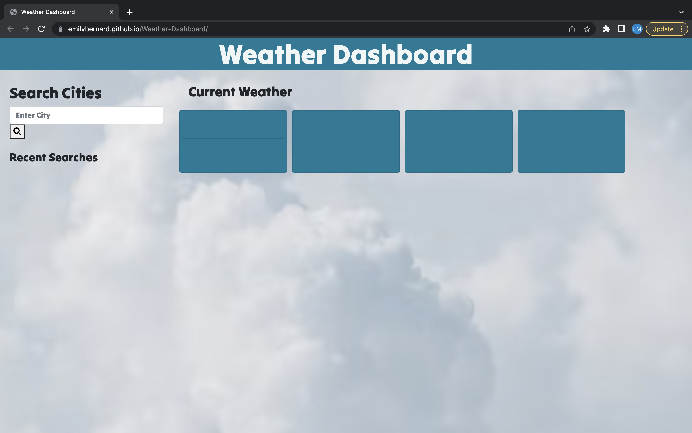

# Weather Dashboard
 Your challenge is to build a weather dashboard that will run in the browser and feature dynamically updated HTML and CSS.

# Current Status
Submitted for review
 
I had trouble getting the application to fully working status.  The styling is there and the html was pretty srtaightforward. 

## User Story
AS A traveler
I WANT to see the weather outlook for multiple cities
SO THAT I can plan a trip accordingly

## Table of Contents

- [Installation](#installation)
- [Screenshot](#screenshot)
- [Links](#links)
- [Acknowledgements](#acknowledgements)

## Installation
This application can be used by clicking this [link](https://emilybernard.github.io/Weather-Dashboard/).
 

## Screenshot

## Links
https://emilybernard.github.io/Weather-Dashboard/
 

https://github.com/EmilyBernard/Weather-Dashboard
 

## Acknowledgements